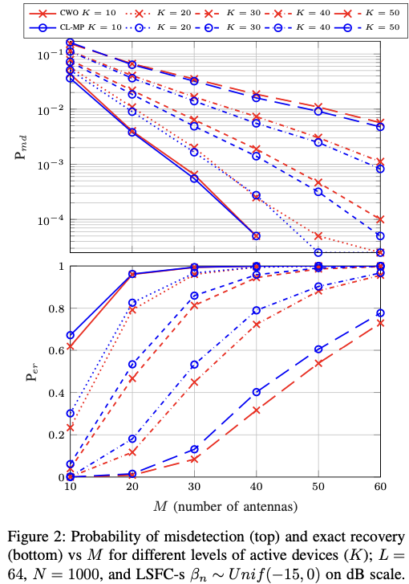

# CL-MP: covariance learning matching pursuit activity detection for massive random access
This repository includes the source code used in our recent paper:

[1] Marata, Leatile, Esa Ollila, and Hirley Alves, ["Activity Detection for Massive Random Access using Covariance-based  Matching Pursuit"](https://arxiv.org/abs/2405.02741), arXiv preprint arXiv:2405.02741 (2024).

If you use the codes, then please cite the reference above!

## Absract
  The Internet of Things paradigm heavily relies on a network of a massive number of machine-type devices (MTDs) that monitor various phenomena. Consequently, MTDs are randomly activated at different times whenever a change occurs. In general, fewer MTDs are activated at the  same time relative to the whole network, which resembles targeted sampling in compressed sensing. Therefore, signal recovery in machine-type communications is addressed through joint user activity detection and channel estimation algorithms built using compressed sensing theory. However, most of these algorithms follow a two-stage procedure in which a channel is first estimated and later mapped to find active users. This approach is inefficient because the estimated channel information is subsequently discarded. To overcome this limitation, we introduce a novel covariance-learning matching pursuit algorithm that bypasses explicit channel estimation. Instead, it focuses on estimating the indices of the active users greedily. Simulation results presented in terms of probability of miss detection, exact recovery rate, and computational complexity validate the proposed technique's superior performance and efficiency.

## Overview
This repository consists of following MATLAB scripts:
* `CLMP.m` main function to compute the proposed CL-MP algorithm
* `activityDetectionPE.m` uses MC-simulatiosn to compute the exact recovery (ER) rate, missdetection (MD) rate and computation times of CL-MP and Coordinatewise optimization method for given N,M,L,K, assuming Bernoulli pilots, and active devive powers uniformly distributed on SNRlow and SNRhigh in dB
* `ActivityDetection_Per_vs_M` setting where number of antennas (M) varies: reproduces the Figure 2, and Figure 3 (top panel) in [1]
* `ActicityDetection_Per_vs_L` setting where pilot length (L) varies: reproduces the Figure 4, and Figure 3 (bottom panel) in [1]
* `ML_coord_descent_round.m` this code for CWO method is not provided but you can download it from the original authors  ["github page"](https://github.com/AlexFengler/mmv-activity-and-random-access). Please see folder 'private' on that page. 

## Requirements
The code should be able to run in a basic matlab.

## Authors
Esa Ollila and Leatile Marata